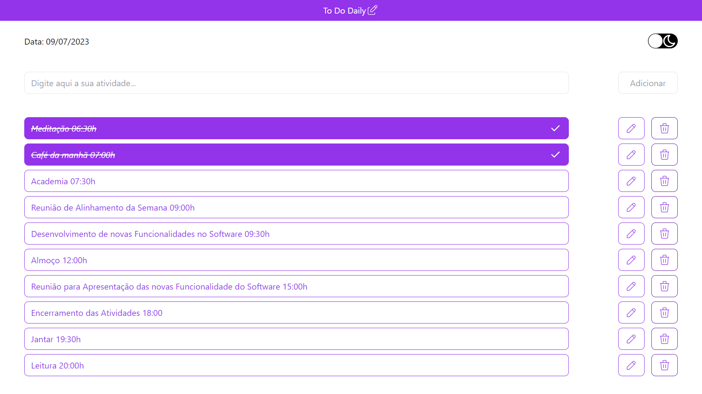

# To Do Daily

  

## 📑 Description

To Do Daily is a tool that aims to help people organize their daily tasks.

## 🔗 Functions

In a CRUD format (Create, Read, Update and Delete), To Do Daily allows the user to create, edit and delete activities, in addition to marking an activity as completed, storing the data in the browser's Local Storage.

Furthermore, To Do Daily presents a responsive layout and a switch with the functionality to change the page theme between light and dark.

## 💻 Language and Tools

For the development of this project, the following languages and tools were used:

- [React](https://react.dev/)
- [Next.js](https://nextjs.org/)
- [Tailwind CSS](https://tailwindcss.com/)
- [TypeScript](https://www.typescriptlang.org/)
- [Tabler-Icons](https://tabler-icons.io/)
- [React-Switch](https://www.npmjs.com/package/react-switch)
- [uuid](https://www.npmjs.com/package/uuid)

## 🚀 Deploy

Click on the link below to access the project 👇🏾

- [To Do Daily](https://to-do-daily.vercel.app/)